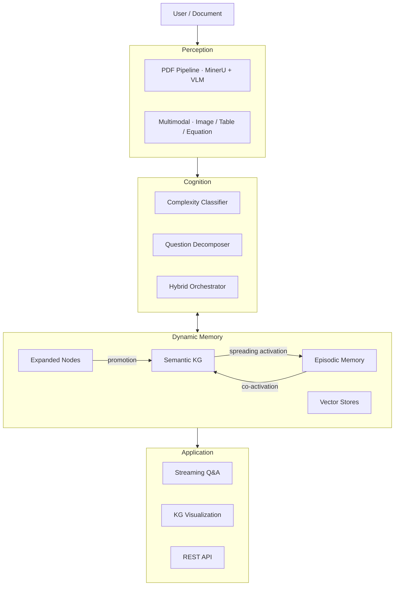
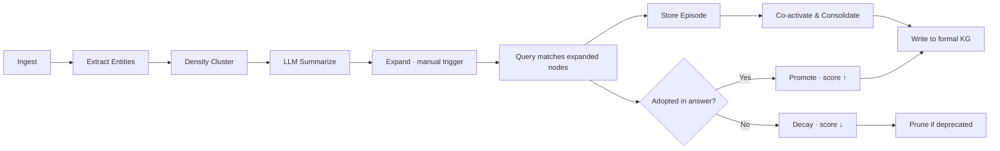

<div align="center">


# DocThinker

**Build a living, self-evolving knowledge graph from your documents.**

> *Memory should be dynamic, not static.*

[](LICENSE)
[](https://www.python.org/downloads/)
[](https://fastapi.tiangolo.com/)
[]()

[中文](README.zh-CN.md) | [English](README.md)

</div>

<!-- TODO: replace with actual screenshot -->
<div align="center">

<p><sub>Knowledge graph visualization with density-clustered expansion, episodic memory links, and multimodal entity nodes.</sub></p>
</div>

---

## ✨ Features

<table>
<tr>
<td align="center" width="25%"><br/><b>🧠 Dynamic KG</b><br/>Knowledge graph that grows, restructures, and prunes itself through usage-driven feedback.<br/><br/></td>
<td align="center" width="25%"><br/><b>💡 Self-Evolution</b><br/>LLM-expanded nodes are validated against real queries — promoted if useful, pruned if not.<br/><br/></td>
<td align="center" width="25%"><br/><b>🔗 Episodic Memory</b><br/>Every Q&A becomes a retrievable episode with spreading activation and co-activation links.<br/><br/></td>
<td align="center" width="25%"><br/><b>📄 Multimodal PDF</b><br/>Dual pipeline (MinerU + VLM) extracts text, tables, equations, and images into KG entities.<br/><br/></td>
</tr>
<tr>
<td align="center"><br/><b>🔬 Density Clustering</b><br/>HDBSCAN clusters entity embeddings post-ingestion; each cluster gets an LLM summary for grounded expansion.<br/><br/></td>
<td align="center"><br/><b>🤖 Auto-Thinking</b><br/>Classifies query complexity and routes to fast vector, hybrid KG, or multi-step decomposition backends.<br/><br/></td>
<td align="center"><br/><b>📊 KG Visualization</b><br/>Interactive D3.js force-directed graph with node descriptions, edge labels, and expand/filter controls.<br/><br/></td>
<td align="center"><br/><b>⚡ 3 Query Modes</b><br/>Fast (vector), Standard (hybrid), Deep (spreading activation + episodic + expansion matching).<br/><br/></td>
</tr>
</table>

## 🚀 Quick Start

```bash
git clone https://github.com/Yang-Jiashu/doc-thinker.git && cd doc-thinker
conda create -n docthinker python=3.11 -y && conda activate docthinker
pip install -r requirements.txt && pip install -e .
cp env.example .env  # ← fill in your API key (OpenAI / DashScope / SiliconFlow)
```

**Launch:**

```bash
# Terminal 1 — backend
python -m uvicorn docthinker.server.app:app --host 0.0.0.0 --port 8000

# Terminal 2 — UI
python run_ui.py
```

Open `http://localhost:5000`. Upload a PDF, ask a question, click **Expand** on the KG page.

## 🏗 Architecture



## 🔄 Self-Evolution Loop



Expanded nodes start as **candidates**. Only those validated by real queries survive — the graph earns its knowledge.

## 🔍 Query Modes

| Mode | Strategy | Speed | Depth |
|------|----------|-------|-------|
| ⚡ **Fast** | Vector similarity | ~1s | Shallow |
| ⚖️ **Standard** | Hybrid KG + vector | ~3s | Medium |
| 🧠 **Deep** | Spreading activation + episodic memory + expansion matching + feedback | ~8s | Full |

<details>
<summary><b>Deep Mode pipeline (6 steps)</b></summary>

1. Retrieve analogous episodes from episodic memory.
2. Match expanded candidate nodes against the query.
3. Inject matched expansions as forced retrieval instructions.
4. Hybrid KG + vector retrieval with spreading activation.
5. LLM generates answer with full context.
6. Post-query: validate expanded nodes, store episode, co-activate links.

</details>

## 📄 PDF Processing

| Mode | Engine | Best for |
|------|--------|----------|
| `auto` (default) | VLM (short) / MinerU (long) | General use |
| `vlm` | Cloud VLM (Qwen-VL) | Image-heavy docs |
| `mineru` | MinerU layout engine | Long docs with tables |

Configure in `config/settings.yaml` or override with `PDF_PARSE_MODE` env var.

## 🌐 KG Expansion

| Phase | Trigger | What happens |
|-------|---------|--------------|
| **Clustering** | Auto (after ingest) | HDBSCAN groups entities → LLM generates cluster summaries |
| **Expansion** | Manual ("Expand" button) | Part A: cluster-grounded generation · Part B: top-50 nodes multi-angle generation |
| **Lifecycle** | Auto (per query) | `candidate → active → promoted` (to formal KG) or `deprecated` (pruned) |

Every expanded node has: concrete description + typed edges + vector embeddings + `is_expanded` flag.

<details>
<summary><b>📡 API Reference</b></summary>

| Category | Endpoint | Method | Description |
|----------|----------|--------|-------------|
| Sessions | `/sessions` | GET/POST | List / create sessions |
| | `/sessions/{id}/history` | GET | Chat history |
| | `/sessions/{id}/files` | GET | Ingested files |
| Ingest | `/ingest` | POST | Upload PDF/TXT |
| | `/ingest/stream` | POST | Stream raw text |
| Query | `/query/stream` | POST | SSE streaming query |
| | `/query` | POST | Non-streaming query |
| KG | `/knowledge-graph/data` | GET | Nodes/edges for viz |
| | `/knowledge-graph/expand` | POST | Trigger expansion |
| | `/knowledge-graph/stats` | GET | KG statistics |
| Memory | `/memory/stats` | GET | Episode counts |
| | `/memory/consolidate` | POST | Run consolidation |
| Settings | `/settings` | GET/POST | Runtime config |

</details>

<details>
<summary><b>📂 Project Structure</b></summary>

| Directory | Description |
|-----------|-------------|
| `docthinker/` | Core: parsing, KG, query, expansion (`kg_expansion/`), auto-thinking (`auto_thinking/`), HyperGraphRAG (`hypergraph/`), server (`server/`), UI (`ui/`). |
| `graphcore/` | Graph RAG engine: KG storage (NetworkX/FAISS/Qdrant/PG), vector retrieval, entity extraction, reranking. |
| `neuro_memory/` | Episodic memory: spreading activation, episode store, analogical retrieval, consolidation. |
| `config/` | `settings.yaml` — PDF, memory, retrieval, cognition parameters. |

</details>

## 🤝 Contributing

PRs and issues welcome! See [CONTRIBUTING.md](CONTRIBUTING.md).

## 📄 License

[MIT](LICENSE)
