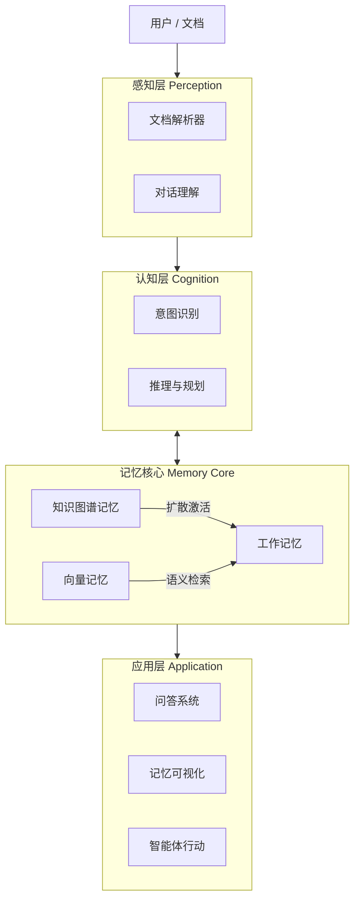

<div align="center">


# 🧠 DocThinker
### 具有类人脑记忆架构的智能个人知识助手
*超越传统检索，像人类一样思考与记忆*

[](LICENSE)
[](https://www.python.org/downloads/)
[]()

[核心特性](#-核心特性) • [架构设计](#-架构设计) • [快速开始](#-快速开始) • [项目结构](#-项目结构)

</div>

---

## 📖 项目简介

**DocThinker** 是下一代智能体系统，旨在突破传统 RAG（检索增强生成）的局限。它不再仅仅是搜索相似的文本片段，而是构建了一个**结构化、类人脑的记忆系统**。

在这个系统中，知识被存储为相互连接的情节（Episodes）、概念（Concepts）和实体（Entities）。它能够像人类大脑一样，理解复杂的文档，建立知识图谱，并主动联想相关信息。

---

## ✨ 核心特性

### 1. 🧠 基于 KG 的记忆架构
DocThinker 将知识图谱（KG）视为记忆本身，而非仅仅是外挂数据库。
- **情节节点 (Episode Nodes)**：每一次交互（文档阅读、对话、事件）都作为图中的一个节点。
- **实体与概念 (Entity & Concept)**：自动提取并链接到相关情节。
- **统一存储**：结构化关系与向量嵌入（Embedding）融合在同一个图谱中。

### 2. 🔗 自动联想机制 (Auto-Association)
系统不仅被动等待查询，更具备主动思考能力。
- **写入时联想 (On-Insert Association)**：新知识写入时，自动发现并连接到已有的相关记忆。
- **扩散激活 (Spreading Activation)**：检索过程模拟人类思维，通过激活概念节点并向四周扩散，寻找潜在关联。
- **自发回忆 (Spontaneous Recall)**：根据上下文主动浮现相关记忆，无需显式搜索。

### 3. 📄 多模态感知 (Multimodal Perception)
基于 **MinerU** 和 **Docling** 强大的解析能力，DocThinker 能够深度理解文档。
- **深度解析**：精准识别 PDF 布局、表格、公式和图片。
- **层级结构保持**：完整保留文档的逻辑结构（章 -> 节 -> 段落），不仅仅是切片。

---

## 🏗 架构设计

系统模仿人类认知过程：**感知 (Perception) → 认知 (Cognition) → 记忆 (Memory) → 应用 (Application)**。



---

## 🚀 快速开始

### 环境要求
- Python 3.10+
- [Anaconda](https://www.anaconda.com/download) 或 [Miniconda](https://docs.conda.io/en/latest/miniconda.html)
- Git

### 安装步骤

```bash
# 1. 克隆仓库
git clone https://github.com/Yang-Jiashu/doc-thinker.git
cd doc-thinker

# 2. 创建并激活 Conda 虚拟环境
conda create -n docthinker python=3.11 -y
conda activate docthinker

# 3. 安装依赖
pip install -U pip
pip install -r requirements.txt
pip install -e .
```

### 配置
复制示例配置文件并填入你的 API Key（支持 OpenAI, DashScope/千问, SiliconFlow 等）：

```bash
cp env.example .env
# 编辑 .env 文件填入 API Key
```

### 运行

**启动交互式对话：**
```bash
python main.py
```

**启动 Web UI（推荐）：**
```bash
# 终端 1：启动 FastAPI 后端
python -m uvicorn docthinker.server.app:app --host 0.0.0.0 --port 8000

# 终端 2：启动 Flask UI
python run_ui.py
```

**仅启动 API 服务：**
```bash
python main.py --server
```

---

## 🔍 查询模式说明

DocThinker 提供三种查询模式，适用于不同场景：

| 模式 | 检索策略 | 适用场景 | 说明 |
|------|---------|---------|------|
| ⚡ **快速模式** | 直接向量匹配（Naive） | 简单事实查询、快速问答 | 跳过扩散激活与深度推理，直接匹配文本块和节点，响应最快。 |
| ⚖️ **标准模式** | 混合检索（Hybrid） | 日常使用（默认） | 结合向量检索与知识图谱结构化查询，平衡速度与答案质量。 |
| 🧠 **深度模式** | 混合检索 + 扩散激活（Mix + Thinking） | 复杂分析、跨文档推理 | 在标准模式基础上启用**扩散激活**（Spreading Activation），沿知识图谱边向外扩散，发掘隐含关联；同时启用多步推理，答案更深入但耗时较长。 |

---

## 📄 PDF 处理配置

PDF 解析模式通过 `config/settings.yaml` 配置：

```yaml
pdf:
  parse_mode: "auto"     # "auto" | "vlm" | "mineru"
  page_threshold: 15     # 仅 auto 模式生效
```

| 模式 | 说明 |
|------|------|
| `auto`（默认） | 自动路由：页数 ≤ `page_threshold` 使用云端 VLM 识别，页数 > `page_threshold` 使用 MinerU 框架进行 OCR 提取。 |
| `vlm` | 强制使用云端 VLM（视觉语言模型）处理所有 PDF，适合短文档或需要图片内容理解的场景。 |
| `mineru` | 强制使用 MinerU 框架处理所有 PDF，适合长文档，可精准提取文档结构、表格和布局信息。 |

> 也可通过环境变量 `PDF_PARSE_MODE` 和 `PDF_VLM_PAGE_THRESHOLD` 覆盖 YAML 配置。

---

## 🌐 知识图谱扩展

在知识图谱可视化页面，点击右上角的 **「扩展」** 按钮可以触发 **LLM 联想扩展**：

- **功能**：系统调用大语言模型，从多个角度（如上下位概念、因果关系、应用场景等）对图谱中已有的核心实体进行联想推理，生成新的候选节点和关系，并自动写入知识图谱。
- **效果**：扩展后的新节点以 **黄色** 显示，与原有节点（蓝/绿/粉色）区分。这些扩展节点补充了文档中未显式提及但逻辑上相关的知识。
- **用途**：在深度模式查询时，扩展节点也会参与扩散激活和匹配，有助于系统理解更广泛的上下文，提升跨领域、跨概念的推理能力。

---

## 📂 项目结构

| 目录 | 说明 |
|------|------|
| `docthinker/` | **核心主库**：文档解析（`parser`、`pdf_pipeline/`）、知识图谱构建（`processor`）、查询引擎（`query`）、认知处理（`cognitive/`）、KG 扩展（`kg_expansion/`）、自动思维链（`auto_thinking/`）、FastAPI 后端（`server/`）、Flask UI（`ui/`）。 |
| `graphcore/` | **图 RAG 引擎**：基于 CoreGraph 的知识图谱存储、向量检索、LLM 绑定、实体/关系提取。被 docthinker 作为底层图引擎调用。 |
| `neuro_memory/` | **类脑记忆引擎**：扩散激活（Spreading Activation）、情节存储（Episode Store）、图存储（Graph Store），与 docthinker 服务端集成。 |
| `linearrag_module/` | **LinearRAG 模块**（可选）：基于 NER 的无关系图 RAG 策略，作为可切换的备选接口保留。 |
| `config/` | **配置文件**：`settings.yaml` 集中管理 PDF 处理、记忆系统、检索、认知等超参数。 |
| `scripts/` | **工具脚本**：连通性测试、PDF 管线测试、配置检查等辅助脚本。 |
| `tests/` | **单元测试**：各模块的自动化测试用例。 |
| `docs/` | **项目文档**：系统流程说明、存储迁移指南、安全检查等。 |
| `data/` | **运行时数据**：会话数据、知识图谱、向量库、多模态图片资产（运行时自动生成，不纳入版本控制）。 |

---

## 🤝 贡献指南

欢迎提交 Pull Request 或 Issue！详见 [CONTRIBUTING.md](CONTRIBUTING.md)。

## 📄 开源协议

本项目采用 [MIT 协议](LICENSE) 开源。
