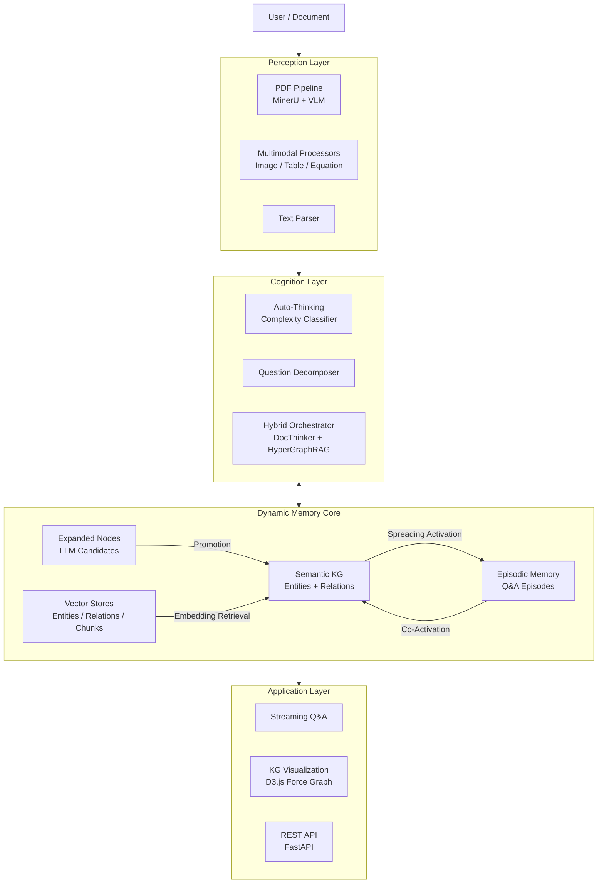
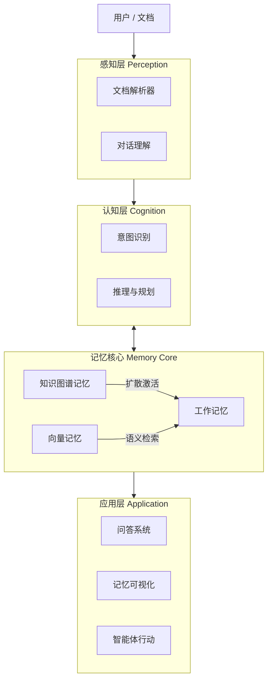

<div align="center">


<<<<<<< Updated upstream
# 🧠 DocThinker
### 具有类人脑记忆架构的智能个人知识助手
*超越传统检索，像人类一样思考与记忆*
=======
# DocThinker

**A Self-Evolving Knowledge System with Brain-Like Dynamic Memory**

*Memory should be dynamic, not static — knowledge that lives, grows, and anticipates.*
>>>>>>> Stashed changes

[](LICENSE)
[](https://www.python.org/downloads/)
[]()

<<<<<<< Updated upstream
[核心特性](#-核心特性) • [架构设计](#-架构设计) • [快速开始](#-快速开始) • [项目结构](#-项目结构)
=======
[English](#-the-problem) | [中文](#-项目简介)
>>>>>>> Stashed changes

</div>

---

<<<<<<< Updated upstream
=======
## 🎯 The Problem

Traditional RAG systems treat knowledge as a **static warehouse**: documents are chunked, embedded, stored, and then passively retrieved when queried. But human memory doesn't work this way. When you read a textbook, you don't just store isolated paragraphs — you build connections, form associations, develop intuitions, and your understanding **evolves with every new interaction**.

**DocThinker** is built on a simple but fundamental insight:

> **Memory should be dynamic, not static.**
> A truly intelligent knowledge system must continuously restructure, expand, and deepen its understanding — not merely retrieve what was stored.

This principle drives every design decision in DocThinker: from how documents are ingested (building interconnected knowledge graphs, not flat chunk stores), to how queries are answered (spreading activation across memory, not just vector similarity search), to how the system evolves over time (self-expanding knowledge, usage-driven promotion, episodic memory consolidation).

## 📖 Overview

**DocThinker** is a next-generation intelligent knowledge assistant that breaks through the limitations of traditional RAG. Instead of searching for similar text chunks, it constructs a **structured, brain-like memory architecture** where knowledge is stored as interconnected Episodes, Concepts, and Entities.

The system implements three core capabilities that distinguish it from conventional RAG:

1. **Dynamic Knowledge Graphs** — Not a static index, but a living graph that grows through LLM-powered expansion, density clustering, and usage-driven evolution.
2. **Episodic Memory with Spreading Activation** — Every Q&A interaction becomes a retrievable episode; future queries activate related memories through graph-based spreading, mimicking human associative recall.
3. **Self-Evolving Intelligence** — The more you interact, the smarter it gets: expanded nodes are validated, promoted, or pruned based on actual usage; episodes consolidate into cross-cutting insights; the knowledge graph continuously restructures itself.

## ✨ Key Features

### 1. Brain-Like Memory Architecture

DocThinker treats the Knowledge Graph as **memory itself**, not just an external database.

| Component | Role | Analogy |
|-----------|------|---------|
| **Semantic KG** | Entities, concepts, and their relationships extracted from documents | Long-term semantic memory |
| **Episodic Memory** | Graph-structured Q&A episodes with temporal and co-activation links | Autobiographical memory |
| **Expanded Nodes** | LLM-generated candidate knowledge, validated through usage | Speculative / anticipatory memory |
| **Vector Stores** | Embedding-based similarity indices for entities, relations, and chunks | Perceptual memory buffers |

All four components are unified within a single session-scoped graph, enabling cross-component retrieval and mutual reinforcement.

### 2. Self-Evolving Knowledge Loop

The knowledge graph is not a one-time build — it **continuously evolves** through three feedback loops:

```
┌──────────────────────────────────────────────────────────┐
│                   Self-Evolution Loop                     │
│                                                          │
│   Ingest ──→ Extract ──→ Cluster ──→ Summarize          │
│                                        │                  │
│              ┌─────────────────────────┘                  │
│              ▼                                            │
│   Expand (manual) ──→ Generate Rich Nodes + Edges        │
│              │                                            │
│              ▼                                            │
│   Query ──→ Match Expanded ──→ LLM Answer                │
│              │                        │                   │
│              ▼                        ▼                   │
│   Validate: adopted in answer?   Store Episode            │
│       │                               │                   │
│       ├─ Yes → Promote (score↑)       ├─ Co-activate      │
│       └─ No  → Decay (score↓)        └─ Consolidate      │
│                                                          │
│   Promoted nodes → Written to formal KG                  │
│   Deprecated nodes → Pruned                              │
└──────────────────────────────────────────────────────────┘
```

- **Expansion → Validation → Promotion**: LLM-generated nodes are candidates; only those actually useful in answering queries get promoted into the permanent knowledge graph.
- **Episodic Co-Activation**: When episodic memories and KG entities fire together during a query, their connection is strengthened, making future co-retrieval more likely.
- **Memory Consolidation**: Periodically, the system discovers cross-episode patterns (analogies, shared themes) and creates new structural edges, much like how the brain consolidates memories during sleep.

### 3. Auto-Thinking Orchestrator

Not all questions are equal. DocThinker automatically classifies query complexity and routes accordingly:

| Complexity | Strategy | Backend |
|------------|----------|---------|
| Simple factual | Direct vector retrieval | GraphCore (fast mode) |
| Moderate | Hybrid KG + vector | GraphCore (standard mode) |
| Complex / multi-step | Question decomposition → sub-queries → aggregation | HybridRAGOrchestrator (DocThinker KG + HyperGraphRAG) |

The `ComplexityClassifier` and `QuestionDecomposer` work together to break complex queries into manageable sub-questions, query different backends in parallel, and synthesize a unified answer.

### 4. Multimodal Document Understanding

Powered by a **dual-source PDF pipeline** combining layout-aware extraction with vision understanding:

| Source | Engine | Strength |
|--------|--------|----------|
| Layout extraction | MinerU | Precise structure, tables, equations, headings |
| Vision extraction | Cloud VLM (e.g. Qwen-VL) | Image understanding, diagram interpretation |

The system automatically routes based on document length (`auto` mode), or you can force a specific engine. Extracted images, tables, and equations are processed by dedicated multimodal processors that:
- Extract surrounding text context for grounding.
- Generate structured descriptions via VLM.
- Create typed entities and relationships in the KG.

### 5. Density-Clustered KG Expansion

After document ingestion, the system runs **density-based clustering** (HDBSCAN/DBSCAN) on entity embeddings to discover naturally grouped concepts. This enables:

- **Cluster Summaries**: Each dense group (≥ 4 entities) receives an LLM-generated thematic summary.
- **Cluster-Based Expansion**: When expansion is triggered, each cluster summary provides grounded context for generating rich new entities with factual descriptions and typed edges.
- **Top-Node Multi-Angle Expansion**: The top 50 entities by connectivity are expanded from multiple cognitive angles (hierarchical, causal, analogical, opposing, temporal, applied).

Every expanded node carries:
- A concrete, factual description (not just a name).
- At least one edge connecting to an existing entity.
- Vector embeddings for retrieval.
- The `is_expanded` flag for lifecycle tracking.

### 6. Episodic Memory Engine

The `neuro_memory` module implements a graph-structured episodic memory:

- **Episode Storage**: Each Q&A turn is stored as an episode node with question, answer, timestamp, and linked entities.
- **Spreading Activation**: Retrieval simulates human cognition — query activates seed nodes, activation spreads through edges with configurable decay, surfacing latent connections.
- **Analogical Retrieval**: Finds structurally similar episodes (not just semantically similar text) by comparing entity-relation patterns.
- **Co-Activation Strengthening**: When episodes and entities activate together, their shared edges are reinforced.
- **Consolidation**: Discovers cross-episode relations (analogies, shared themes), strengthens recently activated paths, and prunes long-unused edges.

## 🏗 Architecture

The system mirrors the human cognitive process: **Perception → Cognition → Memory → Application**.



## 🚀 Quick Start

### Prerequisites
- Python 3.10+
- [Anaconda](https://www.anaconda.com/download) or [Miniconda](https://docs.conda.io/en/latest/miniconda.html)
- Git

### Installation

```bash
# 1. Clone the repository
git clone https://github.com/Yang-Jiashu/doc-thinker.git
cd doc-thinker

# 2. Create and activate a Conda environment
conda create -n docthinker python=3.11 -y
conda activate docthinker

# 3. Install dependencies
pip install -U pip
pip install -r requirements.txt
pip install -e .
```

### Configuration

Copy the example config and fill in your API key (supports OpenAI, DashScope/Qwen, SiliconFlow, etc.):

```bash
cp env.example .env
# Edit .env and fill in your API key
```

Key configuration files:
| File | Purpose |
|------|---------|
| `.env` | API keys, model selection, embedding config |
| `config/settings.yaml` | PDF parsing, memory system, retrieval weights, spreading activation parameters |

### Run

**Start Web UI (recommended):**
```bash
# Terminal 1: Start FastAPI backend
python -m uvicorn docthinker.server.app:app --host 0.0.0.0 --port 8000

# Terminal 2: Start Flask UI
python run_ui.py
```

**Start interactive chat (CLI):**
```bash
python main.py
```

**Start API server only:**
```bash
python main.py --server
```

## 🔍 Query Modes

| Mode | Retrieval Strategy | Use Case | What Happens |
|------|-------------------|----------|--------------|
| ⚡ **Fast** | Direct vector matching (Naive) | Simple fact queries | Vector similarity only; no graph traversal. Fastest response. |
| ⚖️ **Standard** | Hybrid KG + vector | Everyday use (default) | Combines vector retrieval with KG structured queries. Balanced speed and depth. |
| 🧠 **Deep** | Hybrid + Spreading Activation + Episodic Memory + Expansion Matching | Complex analysis, cross-document reasoning | Full pipeline: spreading activation along KG edges, episodic memory retrieval, expanded node matching with forced instructions, co-activation feedback, and memory write-back. Deepest but slowest. |

In **Deep Mode**, the query pipeline integrates all dynamic memory components:
1. Retrieve analogous episodes from episodic memory.
2. Match expanded candidate nodes against the query.
3. Inject matched expansions as forced retrieval instructions.
4. Run hybrid KG + vector retrieval with spreading activation.
5. Generate answer via LLM with full context.
6. Post-query feedback: validate expanded nodes, store episode, co-activate links.

## 📄 PDF Processing

PDF parsing mode is configured via `config/settings.yaml`:

```yaml
pdf:
  parse_mode: "auto"     # "auto" | "vlm" | "mineru"
  page_threshold: 15     # Only effective in auto mode
```

| Mode | Description |
|------|-------------|
| `auto` (default) | Auto-routing: pages ≤ threshold use cloud VLM; pages > threshold use MinerU for OCR. |
| `vlm` | Force cloud VLM for all PDFs. Best for short docs or image-heavy content. |
| `mineru` | Force MinerU for all PDFs. Best for long docs with precise structure/table/layout needs. |

> Override via environment variables `PDF_PARSE_MODE` and `PDF_VLM_PAGE_THRESHOLD`.

## 🌐 Knowledge Graph Expansion

### Phase 1: Density Clustering (automatic after ingestion)

After a document is ingested and entities are extracted, the system automatically:
1. Retrieves all entity embeddings from the vector store.
2. Runs **HDBSCAN** (or DBSCAN fallback) density clustering.
3. For each cluster with ≥ 4 entities, generates an LLM summary capturing the group's theme.
4. Persists cluster summaries for subsequent expansion.

### Phase 2: Two-Part Expansion (manual trigger)

On the KG visualization page, clicking **"Expand"** triggers:

| Part | Input | Output |
|------|-------|--------|
| **A — Cluster-based** | Each density-cluster summary + member entities | Rich entities grounded in cluster context, with descriptions and edges |
| **B — Top-node multi-angle** | Top 50 nodes by degree + descriptions | Entities from hierarchical, causal, analogical, opposing, temporal, and applied angles, each with concrete descriptions and edges back to core nodes |

### Phase 3: Usage-Driven Lifecycle

Expanded nodes are tracked by the `ExpandedNodeManager`:
- **Candidate** → **Active** → **Promoted** (written to formal KG) or **Deprecated** (pruned).
- Promotion requires: `use_count ≥ 2` AND `promotion_score ≥ 1.2`.
- Score increases when an expanded node is adopted in an LLM answer; decreases when ignored.

## 🧠 API Endpoints

### Core APIs

| Category | Endpoint | Method | Description |
|----------|----------|--------|-------------|
| **Sessions** | `/sessions` | GET/POST | List or create sessions |
| | `/sessions/{id}/history` | GET | Retrieve chat history |
| | `/sessions/{id}/files` | GET | List ingested files |
| **Ingest** | `/ingest` | POST | Upload files (PDF/TXT) for background processing |
| | `/ingest/stream` | POST | Stream raw text for ingestion |
| **Query** | `/query/stream` | POST | SSE streaming RAG query |
| | `/query` | POST | Non-streaming RAG query |
| **KG** | `/knowledge-graph/data` | GET | Graph nodes/edges for visualization |
| | `/knowledge-graph/expand` | POST | Trigger two-part KG expansion |
| | `/knowledge-graph/stats` | GET | KG statistics |
| | `/knowledge-graph/entity` | POST | Add entity manually |
| | `/knowledge-graph/relationship` | POST | Add relationship manually |
| **Memory** | `/memory/stats` | GET | Episodic memory statistics |
| | `/memory/graph-data` | GET | Memory graph for visualization |
| | `/memory/consolidate` | POST | Trigger memory consolidation |
| **Settings** | `/settings` | GET/POST | Read or update runtime settings |

## 📂 Project Structure

| Directory | Description |
|-----------|-------------|
| `docthinker/` | **Core library** — document parsing (`parser`, `pdf_pipeline/`), KG construction (`processor`), query engine (`query`), cognitive processing (`cognitive/`), KG expansion with density clustering (`kg_expansion/`), auto chain-of-thought orchestration (`auto_thinking/`), HyperGraphRAG integration (`hypergraph/`), FastAPI backend (`server/`), Flask UI (`ui/`). |
| `graphcore/` | **Graph RAG engine** — CoreGraph-based KG storage (NetworkX, FAISS, Qdrant, PostgreSQL, etc.), vector retrieval, LLM binding, entity/relation extraction, reranking. Serves as the underlying graph engine for DocThinker. |
| `neuro_memory/` | **Brain-like memory engine** — spreading activation, episode store, analogical retrieval, co-activation strengthening, LLM-driven memory consolidation. |
| `config/` | **Configuration** — `settings.yaml` manages PDF processing, memory system, retrieval weights, spreading activation, and cognition parameters. |
| `scripts/` | **Utility scripts** — connectivity tests, PDF pipeline tests, config checks. |
| `tests/` | **Unit tests** — automated test cases for each module. |
| `docs/` | **Documentation** — system flow, storage migration, security checks. |
| `data/` | **Runtime data** — session data, knowledge graphs, vector stores, multimodal assets (auto-generated, not version-controlled). |

## 🤝 Contributing

Pull requests and issues are welcome! See [CONTRIBUTING.md](CONTRIBUTING.md) for details.

## 📄 License

This project is open-sourced under the [MIT License](LICENSE).

---

<details>
<summary><h2>中文</h2></summary>

>>>>>>> Stashed changes
## 📖 项目简介

传统 RAG 系统将知识视为**静态仓库**：文档被切片、向量化、存储，然后在查询时被动检索。但人类的记忆并非如此运作——当你阅读一本教材时，你不是在存储孤立的段落，而是在建立连接、形成联想、发展直觉，你的理解会随着每次新的交互**不断进化**。

**DocThinker** 建立在一个简单但根本性的洞察之上：

> **记忆应该是动态的，而不是静态的。**
> 真正智能的知识系统必须持续重构、扩展和深化其理解——而不仅仅是检索已存储的内容。

**DocThinker** 是下一代智能知识助手，它构建了一个**结构化、类人脑的记忆架构**，知识被存储为相互连接的情节（Episodes）、概念（Concepts）和实体（Entities）。

---

### ✨ 核心特性

#### 1. 类脑动态记忆架构
- **语义知识图谱**：从文档中提取的实体、概念及其关系（长期语义记忆）。
- **情节记忆**：图结构的问答情节，带有时间和共激活链接（自传式记忆）。
- **扩展节点**：LLM 生成的候选知识，通过使用验证机制进化（预期/推测性记忆）。
- **向量索引**：实体、关系和文本块的 embedding 相似度索引（感知记忆缓冲）。

#### 2. 自进化知识循环
- **扩展 → 验证 → 晋升**：LLM 生成的节点是候选者，只有在实际回答中被采用的才会晋升为正式知识。
- **情节共激活**：当情节记忆和 KG 实体在查询中共同被激活，它们的连接会被强化。
- **记忆固化**：系统周期性地发现跨情节模式（类比、共同主题），创建新的结构性边。

#### 3. 自动思考编排
- 自动分类查询复杂度，路由到不同后端（快速向量检索 / 混合 KG 查询 / 多步分解 + 聚合）。
- `ComplexityClassifier` + `QuestionDecomposer` 协同工作，将复杂查询拆解为子问题并行处理。

#### 4. 多模态文档理解
- 双源 PDF 管线：MinerU 布局提取 + 云端 VLM 视觉理解，自动按文档长度路由。
- 图片、表格、公式专用处理器，提取上下文并生成结构化描述。

#### 5. 密度聚类知识图谱扩展
- 文档上传后自动运行 HDBSCAN/DBSCAN 密度聚类，发现紧密关联实体组。
- 两部分扩展：基于聚类摘要 + 基于高度数节点多角度联想。
- 每个扩展节点带有具体描述、类型化边、向量嵌入和生命周期追踪。

---

<<<<<<< Updated upstream
## 🏗 架构设计

系统模仿人类认知过程：**感知 (Perception) → 认知 (Cognition) → 记忆 (Memory) → 应用 (Application)**。



---

## 🚀 快速开始

### 环境要求
- Python 3.10+
- Git

### 安装步骤

```bash
# 1. 克隆仓库
git clone https://github.com/Yang-Jiashu/doc-thinker.git
cd doc-thinker

# 2. 创建并激活虚拟环境
python -m venv .venv
# Windows:
.venv\Scripts\activate
# Linux/macOS:
# source .venv/bin/activate

# 3. 安装依赖
pip install -U pip
pip install -r requirements.txt
pip install -e .
```

### 配置
复制示例配置文件并填入你的 API Key（支持 OpenAI, DashScope, SiliconFlow 等）：

```bash
cp env.example .env
# 编辑 .env 文件填入 API Key
```

### 运行

**启动交互式对话：**
```bash
python main.py
```

**启动 API 服务：**
```bash
python main.py --server
```

---

## 📂 项目结构

| 目录 | 说明 |
|------|------|
| `docthinker/` | **DocThinker 主库**：解析、入库、查询、知识图谱、超图、认知、UI、FastAPI 后端（`docthinker.server.app`）。 |
| `graphcore/` | **图 RAG 引擎**：KG 与向量检索、LLM 绑定等，被 docthinker 调用。 |
| `neuro_core/` | **类脑记忆（NeuroAgent）**：KG 构建、扩散激活、自动联想，供 `main.py` 交互/API 使用。 |
| `neuro_memory/` | **类脑记忆（DocThinker 集成）**：与 docthinker 服务端集成的记忆引擎。 |
| `perception/` | **感知层**：文档解析（PDF/MD）与对话输入。 |
| `cognition/` | **认知层**：意图理解与任务规划。 |
| `agent/` | **智能体编排**：Agent 逻辑与会话管理。 |
| `retrieval/` | **检索层**：混合检索（图 + 向量）。 |
| `api/` | **NeuroAgent 的 FastAPI**：`main.py --server` 时使用。 |

**启动说明**：Web UI 使用 **DocThinker 后端** 时，请先启动 `python -m uvicorn docthinker.server.app:app --host 0.0.0.0 --port 8000`，再在另一终端运行 `python run_ui.py`；仅需 **NeuroAgent** 时使用 `python main.py` / `python main.py --server`。

---

## 🤝 贡献指南
=======
### 🤝 贡献指南
>>>>>>> Stashed changes

欢迎提交 Pull Request 或 Issue！详见 [CONTRIBUTING.md](CONTRIBUTING.md)。

### 📄 开源协议

本项目采用 [MIT 协议](LICENSE) 开源。
