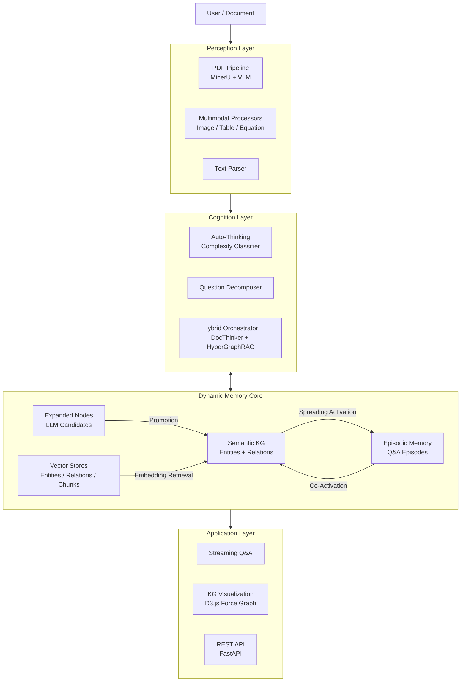
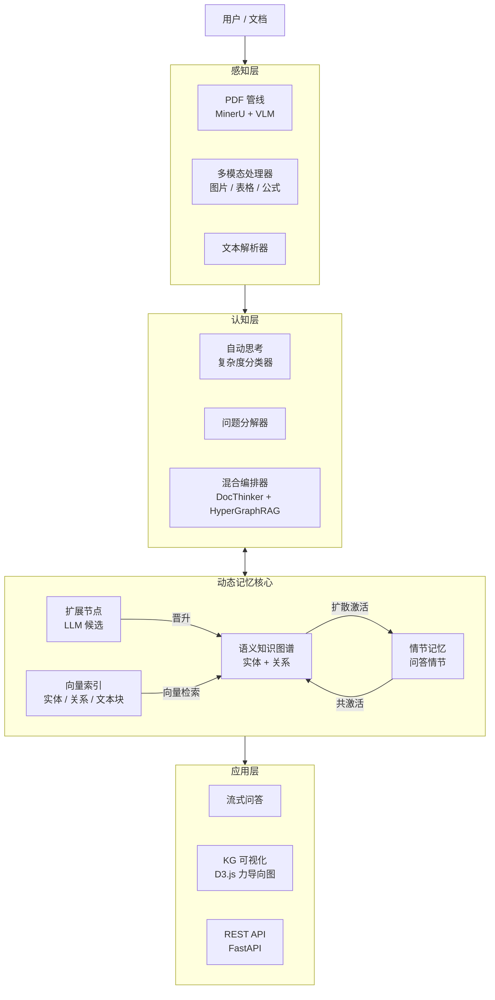

<div align="center">


# DocThinker

**A Self-Evolving Knowledge System with Brain-Like Dynamic Memory**

*Memory should be dynamic, not static — knowledge that lives, grows, and anticipates.*

[](LICENSE)
[](https://www.python.org/downloads/)
[]()

[English](#-the-problem) | [中文](#-项目简介)

</div>

---

## 🎯 The Problem

Traditional RAG systems treat knowledge as a **static warehouse**: documents are chunked, embedded, stored, and then passively retrieved when queried. But human memory doesn't work this way. When you read a textbook, you don't just store isolated paragraphs — you build connections, form associations, develop intuitions, and your understanding **evolves with every new interaction**.

**DocThinker** is built on a simple but fundamental insight:

> **Memory should be dynamic, not static.**
> A truly intelligent knowledge system must continuously restructure, expand, and deepen its understanding — not merely retrieve what was stored.

This principle drives every design decision in DocThinker: from how documents are ingested (building interconnected knowledge graphs, not flat chunk stores), to how queries are answered (spreading activation across memory, not just vector similarity search), to how the system evolves over time (self-expanding knowledge, usage-driven promotion, episodic memory consolidation).

## 📖 Overview

**DocThinker** is a next-generation intelligent knowledge assistant that breaks through the limitations of traditional RAG. Instead of searching for similar text chunks, it constructs a **structured, brain-like memory architecture** where knowledge is stored as interconnected Episodes, Concepts, and Entities.

The system implements three core capabilities that distinguish it from conventional RAG:

1. **Dynamic Knowledge Graphs** — Not a static index, but a living graph that grows through LLM-powered expansion, density clustering, and usage-driven evolution.
2. **Episodic Memory with Spreading Activation** — Every Q&A interaction becomes a retrievable episode; future queries activate related memories through graph-based spreading, mimicking human associative recall.
3. **Self-Evolving Intelligence** — The more you interact, the smarter it gets: expanded nodes are validated, promoted, or pruned based on actual usage; episodes consolidate into cross-cutting insights; the knowledge graph continuously restructures itself.

## ✨ Key Features

### 1. Brain-Like Memory Architecture

DocThinker treats the Knowledge Graph as **memory itself**, not just an external database.

| Component | Role | Analogy |
|-----------|------|---------|
| **Semantic KG** | Entities, concepts, and their relationships extracted from documents | Long-term semantic memory |
| **Episodic Memory** | Graph-structured Q&A episodes with temporal and co-activation links | Autobiographical memory |
| **Expanded Nodes** | LLM-generated candidate knowledge, validated through usage | Speculative / anticipatory memory |
| **Vector Stores** | Embedding-based similarity indices for entities, relations, and chunks | Perceptual memory buffers |

All four components are unified within a single session-scoped graph, enabling cross-component retrieval and mutual reinforcement.

### 2. Self-Evolving Knowledge Loop

The knowledge graph is not a one-time build — it **continuously evolves** through three feedback loops:

```
┌──────────────────────────────────────────────────────────┐
│                   Self-Evolution Loop                     │
│                                                          │
│   Ingest ──→ Extract ──→ Cluster ──→ Summarize          │
│                                        │                  │
│              ┌─────────────────────────┘                  │
│              ▼                                            │
│   Expand (manual) ──→ Generate Rich Nodes + Edges        │
│              │                                            │
│              ▼                                            │
│   Query ──→ Match Expanded ──→ LLM Answer                │
│              │                        │                   │
│              ▼                        ▼                   │
│   Validate: adopted in answer?   Store Episode            │
│       │                               │                   │
│       ├─ Yes → Promote (score↑)       ├─ Co-activate      │
│       └─ No  → Decay (score↓)        └─ Consolidate      │
│                                                          │
│   Promoted nodes → Written to formal KG                  │
│   Deprecated nodes → Pruned                              │
└──────────────────────────────────────────────────────────┘
```

- **Expansion → Validation → Promotion**: LLM-generated nodes are candidates; only those actually useful in answering queries get promoted into the permanent knowledge graph.
- **Episodic Co-Activation**: When episodic memories and KG entities fire together during a query, their connection is strengthened, making future co-retrieval more likely.
- **Memory Consolidation**: Periodically, the system discovers cross-episode patterns (analogies, shared themes) and creates new structural edges, much like how the brain consolidates memories during sleep.

### 3. Auto-Thinking Orchestrator

Not all questions are equal. DocThinker automatically classifies query complexity and routes accordingly:

| Complexity | Strategy | Backend |
|------------|----------|---------|
| Simple factual | Direct vector retrieval | GraphCore (fast mode) |
| Moderate | Hybrid KG + vector | GraphCore (standard mode) |
| Complex / multi-step | Question decomposition → sub-queries → aggregation | HybridRAGOrchestrator (DocThinker KG + HyperGraphRAG) |

The `ComplexityClassifier` and `QuestionDecomposer` work together to break complex queries into manageable sub-questions, query different backends in parallel, and synthesize a unified answer.

### 4. Multimodal Document Understanding

Powered by a **dual-source PDF pipeline** combining layout-aware extraction with vision understanding:

| Source | Engine | Strength |
|--------|--------|----------|
| Layout extraction | MinerU | Precise structure, tables, equations, headings |
| Vision extraction | Cloud VLM (e.g. Qwen-VL) | Image understanding, diagram interpretation |

The system automatically routes based on document length (`auto` mode), or you can force a specific engine. Extracted images, tables, and equations are processed by dedicated multimodal processors that:
- Extract surrounding text context for grounding.
- Generate structured descriptions via VLM.
- Create typed entities and relationships in the KG.

### 5. Density-Clustered KG Expansion

After document ingestion, the system runs **density-based clustering** (HDBSCAN/DBSCAN) on entity embeddings to discover naturally grouped concepts. This enables:

- **Cluster Summaries**: Each dense group (≥ 4 entities) receives an LLM-generated thematic summary.
- **Cluster-Based Expansion**: When expansion is triggered, each cluster summary provides grounded context for generating rich new entities with factual descriptions and typed edges.
- **Top-Node Multi-Angle Expansion**: The top 50 entities by connectivity are expanded from multiple cognitive angles (hierarchical, causal, analogical, opposing, temporal, applied).

Every expanded node carries:
- A concrete, factual description (not just a name).
- At least one edge connecting to an existing entity.
- Vector embeddings for retrieval.
- The `is_expanded` flag for lifecycle tracking.

### 6. Episodic Memory Engine

The `neuro_memory` module implements a graph-structured episodic memory:

- **Episode Storage**: Each Q&A turn is stored as an episode node with question, answer, timestamp, and linked entities.
- **Spreading Activation**: Retrieval simulates human cognition — query activates seed nodes, activation spreads through edges with configurable decay, surfacing latent connections.
- **Analogical Retrieval**: Finds structurally similar episodes (not just semantically similar text) by comparing entity-relation patterns.
- **Co-Activation Strengthening**: When episodes and entities activate together, their shared edges are reinforced.
- **Consolidation**: Discovers cross-episode relations (analogies, shared themes), strengthens recently activated paths, and prunes long-unused edges.

## 🏗 Architecture

The system mirrors the human cognitive process: **Perception → Cognition → Memory → Application**.



## 🚀 Quick Start

### Prerequisites
- Python 3.10+
- [Anaconda](https://www.anaconda.com/download) or [Miniconda](https://docs.conda.io/en/latest/miniconda.html)
- Git

### Installation

```bash
# 1. Clone the repository
git clone https://github.com/Yang-Jiashu/doc-thinker.git
cd doc-thinker

# 2. Create and activate a Conda environment
conda create -n docthinker python=3.11 -y
conda activate docthinker

# 3. Install dependencies
pip install -U pip
pip install -r requirements.txt
pip install -e .
```

### Configuration

Copy the example config and fill in your API key (supports OpenAI, DashScope/Qwen, SiliconFlow, etc.):

```bash
cp env.example .env
# Edit .env and fill in your API key
```

Key configuration files:

| File | Purpose |
|------|---------|
| `.env` | API keys, model selection, embedding config |
| `config/settings.yaml` | PDF parsing, memory system, retrieval weights, spreading activation parameters |

### Run

**Start Web UI (recommended):**
```bash
# Terminal 1: Start FastAPI backend
python -m uvicorn docthinker.server.app:app --host 0.0.0.0 --port 8000

# Terminal 2: Start Flask UI
python run_ui.py
```

**Start interactive chat (CLI):**
```bash
python main.py
```

**Start API server only:**
```bash
python main.py --server
```

## 🔍 Query Modes

| Mode | Retrieval Strategy | Use Case | What Happens |
|------|-------------------|----------|--------------|
| ⚡ **Fast** | Direct vector matching (Naive) | Simple fact queries | Vector similarity only; no graph traversal. Fastest response. |
| ⚖️ **Standard** | Hybrid KG + vector | Everyday use (default) | Combines vector retrieval with KG structured queries. Balanced speed and depth. |
| 🧠 **Deep** | Hybrid + Spreading Activation + Episodic Memory + Expansion Matching | Complex analysis, cross-document reasoning | Full pipeline: spreading activation along KG edges, episodic memory retrieval, expanded node matching with forced instructions, co-activation feedback, and memory write-back. Deepest but slowest. |

In **Deep Mode**, the query pipeline integrates all dynamic memory components:
1. Retrieve analogous episodes from episodic memory.
2. Match expanded candidate nodes against the query.
3. Inject matched expansions as forced retrieval instructions.
4. Run hybrid KG + vector retrieval with spreading activation.
5. Generate answer via LLM with full context.
6. Post-query feedback: validate expanded nodes, store episode, co-activate links.

## 📄 PDF Processing

PDF parsing mode is configured via `config/settings.yaml`:

```yaml
pdf:
  parse_mode: "auto"     # "auto" | "vlm" | "mineru"
  page_threshold: 15     # Only effective in auto mode
```

| Mode | Description |
|------|-------------|
| `auto` (default) | Auto-routing: pages ≤ threshold use cloud VLM; pages > threshold use MinerU for OCR. |
| `vlm` | Force cloud VLM for all PDFs. Best for short docs or image-heavy content. |
| `mineru` | Force MinerU for all PDFs. Best for long docs with precise structure/table/layout needs. |

> Override via environment variables `PDF_PARSE_MODE` and `PDF_VLM_PAGE_THRESHOLD`.

## 🌐 Knowledge Graph Expansion

### Phase 1: Density Clustering (automatic after ingestion)

After a document is ingested and entities are extracted, the system automatically:
1. Retrieves all entity embeddings from the vector store.
2. Runs **HDBSCAN** (or DBSCAN fallback) density clustering.
3. For each cluster with ≥ 4 entities, generates an LLM summary capturing the group's theme.
4. Persists cluster summaries for subsequent expansion.

### Phase 2: Two-Part Expansion (manual trigger)

On the KG visualization page, clicking **"Expand"** triggers:

| Part | Input | Output |
|------|-------|--------|
| **A — Cluster-based** | Each density-cluster summary + member entities | Rich entities grounded in cluster context, with descriptions and edges |
| **B — Top-node multi-angle** | Top 50 nodes by degree + descriptions | Entities from hierarchical, causal, analogical, opposing, temporal, and applied angles, each with concrete descriptions and edges back to core nodes |

### Phase 3: Usage-Driven Lifecycle

Expanded nodes are tracked by the `ExpandedNodeManager`:
- **Candidate** → **Active** → **Promoted** (written to formal KG) or **Deprecated** (pruned).
- Promotion requires: `use_count ≥ 2` AND `promotion_score ≥ 1.2`.
- Score increases when an expanded node is adopted in an LLM answer; decreases when ignored.

## 🧠 API Endpoints

| Category | Endpoint | Method | Description |
|----------|----------|--------|-------------|
| **Sessions** | `/sessions` | GET/POST | List or create sessions |
| | `/sessions/{id}/history` | GET | Retrieve chat history |
| | `/sessions/{id}/files` | GET | List ingested files |
| **Ingest** | `/ingest` | POST | Upload files (PDF/TXT) for background processing |
| | `/ingest/stream` | POST | Stream raw text for ingestion |
| **Query** | `/query/stream` | POST | SSE streaming RAG query |
| | `/query` | POST | Non-streaming RAG query |
| **KG** | `/knowledge-graph/data` | GET | Graph nodes/edges for visualization |
| | `/knowledge-graph/expand` | POST | Trigger two-part KG expansion |
| | `/knowledge-graph/stats` | GET | KG statistics |
| | `/knowledge-graph/entity` | POST | Add entity manually |
| | `/knowledge-graph/relationship` | POST | Add relationship manually |
| **Memory** | `/memory/stats` | GET | Episodic memory statistics |
| | `/memory/graph-data` | GET | Memory graph for visualization |
| | `/memory/consolidate` | POST | Trigger memory consolidation |
| **Settings** | `/settings` | GET/POST | Read or update runtime settings |

## 📂 Project Structure

| Directory | Description |
|-----------|-------------|
| `docthinker/` | **Core library** — document parsing (`parser`, `pdf_pipeline/`), KG construction (`processor`), query engine (`query`), cognitive processing (`cognitive/`), KG expansion with density clustering (`kg_expansion/`), auto chain-of-thought orchestration (`auto_thinking/`), HyperGraphRAG integration (`hypergraph/`), FastAPI backend (`server/`), Flask UI (`ui/`). |
| `graphcore/` | **Graph RAG engine** — CoreGraph-based KG storage (NetworkX, FAISS, Qdrant, PostgreSQL, etc.), vector retrieval, LLM binding, entity/relation extraction, reranking. Serves as the underlying graph engine for DocThinker. |
| `neuro_memory/` | **Brain-like memory engine** — spreading activation, episode store, analogical retrieval, co-activation strengthening, LLM-driven memory consolidation. |
| `config/` | **Configuration** — `settings.yaml` manages PDF processing, memory system, retrieval weights, spreading activation, and cognition parameters. |
| `scripts/` | **Utility scripts** — connectivity tests, PDF pipeline tests, config checks. |
| `tests/` | **Unit tests** — automated test cases for each module. |
| `docs/` | **Documentation** — system flow, storage migration, security checks. |
| `data/` | **Runtime data** — session data, knowledge graphs, vector stores, multimodal assets (auto-generated, not version-controlled). |

## 🤝 Contributing

Pull requests and issues are welcome! See [CONTRIBUTING.md](CONTRIBUTING.md) for details.

## 📄 License

This project is open-sourced under the [MIT License](LICENSE).

---

<details>
<summary><h2>中文</h2></summary>

## 📖 项目简介

### 问题

传统 RAG 系统将知识视为**静态仓库**：文档被切片、向量化、存储，然后在查询时被动检索。但人类的记忆并非如此运作——当你阅读一本教材时，你不是在存储孤立的段落，而是在建立连接、形成联想、发展直觉，你的理解会随着每次新的交互**不断进化**。

**DocThinker** 建立在一个简单但根本性的洞察之上：

> **记忆应该是动态的，而不是静态的。**
> 真正智能的知识系统必须持续重构、扩展和深化其理解——而不仅仅是检索已存储的内容。

### 概述

**DocThinker** 是下一代智能知识助手，它构建了一个**结构化、类人脑的记忆架构**，知识被存储为相互连接的情节（Episodes）、概念（Concepts）和实体（Entities）。

系统实现了三项核心能力：

1. **动态知识图谱** — 不是静态索引，而是通过 LLM 驱动的扩展、密度聚类和使用驱动的进化持续生长的活图谱。
2. **情节记忆与扩散激活** — 每次问答交互都成为可检索的情节；未来的查询通过图上的扩散激活唤醒相关记忆，模拟人类联想回忆。
3. **自进化智能** — 交互越多，系统越聪明：扩展节点基于实际使用被验证、晋升或淘汰；情节记忆固化为跨主题洞察；知识图谱持续自我重构。

---

### ✨ 核心特性

#### 1. 类脑动态记忆架构

| 组件 | 角色 | 认知类比 |
|------|------|---------|
| **语义知识图谱** | 从文档中提取的实体、概念及其关系 | 长期语义记忆 |
| **情节记忆** | 图结构的问答情节，带有时间和共激活链接 | 自传式记忆 |
| **扩展节点** | LLM 生成的候选知识，通过使用验证机制进化 | 预期/推测性记忆 |
| **向量索引** | 实体、关系和文本块的 embedding 相似度索引 | 感知记忆缓冲 |

四个组件统一在会话级图谱中，支持跨组件检索与互相增强。

#### 2. 自进化知识循环

```
┌──────────────────────────────────────────────────────────┐
│                     自进化循环                              │
│                                                          │
│   上传文档 ──→ 实体提取 ──→ 密度聚类 ──→ 摘要生成         │
│                                          │                │
│              ┌───────────────────────────┘                │
│              ▼                                            │
│   扩展（手动触发）──→ 生成带描述+边的丰富节点              │
│              │                                            │
│              ▼                                            │
│   查询 ──→ 匹配扩展节点 ──→ LLM 生成回答                 │
│              │                      │                     │
│              ▼                      ▼                     │
│   验证：回答中是否采用？       存储情节记忆                 │
│       │                            │                      │
│       ├─ 是 → 晋升（得分↑）        ├─ 共激活强化           │
│       └─ 否 → 衰减（得分↓）       └─ 记忆固化             │
│                                                          │
│   晋升节点 → 写入正式知识图谱                              │
│   废弃节点 → 剪枝                                         │
└──────────────────────────────────────────────────────────┘
```

- **扩展 → 验证 → 晋升**：LLM 生成的节点是候选者，只有在实际回答中被采用的才会晋升为正式知识。
- **情节共激活**：当情节记忆和 KG 实体在查询中共同被激活，它们的连接会被强化，使未来共同检索更可能。
- **记忆固化**：系统周期性地发现跨情节模式（类比、共同主题），创建新的结构性边，类似人脑在睡眠中固化记忆。

#### 3. 自动思考编排

| 复杂度 | 策略 | 后端 |
|--------|------|------|
| 简单事实 | 直接向量检索 | GraphCore（快速模式）|
| 中等 | 混合 KG + 向量 | GraphCore（标准模式）|
| 复杂/多步 | 问题分解 → 子查询 → 聚合 | HybridRAGOrchestrator（DocThinker KG + HyperGraphRAG）|

`ComplexityClassifier` + `QuestionDecomposer` 协同工作，将复杂查询拆解为子问题并行处理，跨后端查询并综合答案。

#### 4. 多模态文档理解

| 来源 | 引擎 | 优势 |
|------|------|------|
| 布局提取 | MinerU | 精准的结构、表格、公式、标题识别 |
| 视觉提取 | 云端 VLM（如 Qwen-VL） | 图像理解、图表解读 |

系统根据文档长度自动路由（`auto` 模式），也可强制指定引擎。提取的图片、表格和公式由专用多模态处理器处理：提取上下文文本、通过 VLM 生成结构化描述、在 KG 中创建类型化实体与关系。

#### 5. 密度聚类知识图谱扩展

**第一阶段：密度聚类（文档上传后自动执行）**
1. 从实体向量库提取节点 embedding。
2. 运行 **HDBSCAN**（或 DBSCAN 回退）密度聚类。
3. 对 ≥ 4 个实体的聚类，使用 LLM 生成该组的主题摘要。
4. 持久化聚类摘要供后续扩展使用。

**第二阶段：两部分扩展（手动触发"扩展"按钮）**

| 部分 | 输入 | 输出 |
|------|------|------|
| **A — 基于聚类** | 每个密度聚类摘要 + 成员实体 | 基于聚类上下文的具体实体，带有事实性描述和边 |
| **B — 高权重多角度** | 度排名前 50 的节点 + 描述 | 从层级、因果、类比、对立、时间、应用等角度生成具体实体，每个带有详实描述和与核心节点的边 |

**第三阶段：使用驱动的生命周期**

扩展节点由 `ExpandedNodeManager` 追踪：
- **候选** → **活跃** → **晋升**（写入正式 KG）或 **废弃**（剪枝）。
- 晋升条件：`use_count ≥ 2` 且 `promotion_score ≥ 1.2`。
- 扩展节点在回答中被采用则得分增加，被忽略则衰减。

#### 6. 情节记忆引擎

`neuro_memory` 模块实现了图结构的情节记忆：

- **情节存储**：每轮问答存储为情节节点，包含问题、答案、时间戳和关联实体。
- **扩散激活**：检索模拟人类认知——查询激活种子节点，激活沿边扩散（可配置衰减），发掘潜在关联。
- **类比检索**：通过比较实体-关系模式找到结构上相似的情节（不仅是语义相似的文本）。
- **共激活强化**：当情节和实体共同被激活，它们的共享边被增强。
- **固化**：发现跨情节关系（类比、共同主题），强化近期活跃路径，剪枝长期未用的边。

---

### 🏗 架构设计

系统模仿人类认知过程：**感知 → 认知 → 记忆 → 应用**。



---

### 🚀 快速开始

#### 环境要求
- Python 3.10+
- [Anaconda](https://www.anaconda.com/download) 或 [Miniconda](https://docs.conda.io/en/latest/miniconda.html)
- Git

#### 安装步骤

```bash
# 1. 克隆仓库
git clone https://github.com/Yang-Jiashu/doc-thinker.git
cd doc-thinker

# 2. 创建并激活 Conda 虚拟环境
conda create -n docthinker python=3.11 -y
conda activate docthinker

# 3. 安装依赖
pip install -U pip
pip install -r requirements.txt
pip install -e .
```

#### 配置

复制示例配置文件并填入你的 API Key（支持 OpenAI、DashScope/千问、SiliconFlow 等）：

```bash
cp env.example .env
# 编辑 .env 文件填入 API Key
```

关键配置文件：

| 文件 | 用途 |
|------|------|
| `.env` | API Key、模型选择、Embedding 配置 |
| `config/settings.yaml` | PDF 处理、记忆系统、检索权重、扩散激活参数 |

#### 运行

**启动 Web UI（推荐）：**
```bash
# 终端 1：启动 FastAPI 后端
python -m uvicorn docthinker.server.app:app --host 0.0.0.0 --port 8000

# 终端 2：启动 Flask UI
python run_ui.py
```

**启动交互式对话（命令行）：**
```bash
python main.py
```

**仅启动 API 服务：**
```bash
python main.py --server
```

---

### 🔍 查询模式

| 模式 | 检索策略 | 适用场景 | 处理流程 |
|------|---------|---------|---------|
| ⚡ **快速** | 直接向量匹配（Naive） | 简单事实查询 | 仅向量相似度，不进行图遍历。响应最快。 |
| ⚖️ **标准** | 混合 KG + 向量 | 日常使用（默认） | 结合向量检索与 KG 结构化查询。平衡速度与深度。 |
| 🧠 **深度** | 混合 + 扩散激活 + 情节记忆 + 扩展匹配 | 复杂分析、跨文档推理 | 完整管线：KG 边上扩散激活、情节记忆检索、扩展节点匹配与强制指令注入、共激活反馈和记忆回写。最深但最慢。 |

**深度模式**的查询管线集成所有动态记忆组件：
1. 从情节记忆中检索类比情节。
2. 将扩展候选节点与查询进行匹配。
3. 将命中的扩展节点作为强制检索指令注入。
4. 运行混合 KG + 向量检索并启用扩散激活。
5. 使用完整上下文通过 LLM 生成回答。
6. 查询后反馈：验证扩展节点、存储情节、共激活链接强化。

---

### 📄 PDF 处理

PDF 解析模式通过 `config/settings.yaml` 配置：

```yaml
pdf:
  parse_mode: "auto"     # "auto" | "vlm" | "mineru"
  page_threshold: 15     # 仅 auto 模式生效
```

| 模式 | 说明 |
|------|------|
| `auto`（默认） | 自动路由：页数 ≤ 阈值使用云端 VLM；页数 > 阈值使用 MinerU 进行 OCR 提取。 |
| `vlm` | 强制使用云端 VLM 处理所有 PDF。适合短文档或图片密集内容。 |
| `mineru` | 强制使用 MinerU 处理所有 PDF。适合需要精准结构/表格/布局的长文档。 |

> 可通过环境变量 `PDF_PARSE_MODE` 和 `PDF_VLM_PAGE_THRESHOLD` 覆盖配置。

---

### 🧠 API 端点

| 类别 | 端点 | 方法 | 说明 |
|------|------|------|------|
| **会话** | `/sessions` | GET/POST | 列出或创建会话 |
| | `/sessions/{id}/history` | GET | 获取聊天历史 |
| | `/sessions/{id}/files` | GET | 列出已上传文件 |
| **上传** | `/ingest` | POST | 上传文件（PDF/TXT）进行后台处理 |
| | `/ingest/stream` | POST | 流式文本上传 |
| **查询** | `/query/stream` | POST | SSE 流式 RAG 查询 |
| | `/query` | POST | 非流式 RAG 查询 |
| **KG** | `/knowledge-graph/data` | GET | 可视化用图谱节点/边 |
| | `/knowledge-graph/expand` | POST | 触发两部分 KG 扩展 |
| | `/knowledge-graph/stats` | GET | KG 统计信息 |
| | `/knowledge-graph/entity` | POST | 手动添加实体 |
| | `/knowledge-graph/relationship` | POST | 手动添加关系 |
| **记忆** | `/memory/stats` | GET | 情节记忆统计 |
| | `/memory/graph-data` | GET | 记忆图谱可视化数据 |
| | `/memory/consolidate` | POST | 触发记忆固化 |
| **设置** | `/settings` | GET/POST | 读取或更新运行时设置 |

---

### 📂 项目结构

| 目录 | 说明 |
|------|------|
| `docthinker/` | **核心主库** — 文档解析（`parser`、`pdf_pipeline/`）、KG 构建（`processor`）、查询引擎（`query`）、认知处理（`cognitive/`）、带密度聚类的 KG 扩展（`kg_expansion/`）、自动思维链编排（`auto_thinking/`）、HyperGraphRAG 集成（`hypergraph/`）、FastAPI 后端（`server/`）、Flask UI（`ui/`）。 |
| `graphcore/` | **图 RAG 引擎** — 基于 CoreGraph 的 KG 存储（NetworkX、FAISS、Qdrant、PostgreSQL 等）、向量检索、LLM 绑定、实体/关系提取、重排序。作为 DocThinker 的底层图引擎。 |
| `neuro_memory/` | **类脑记忆引擎** — 扩散激活、情节存储、类比检索、共激活强化、LLM 驱动的记忆固化。 |
| `config/` | **配置文件** — `settings.yaml` 管理 PDF 处理、记忆系统、检索权重、扩散激活和认知参数。 |
| `scripts/` | **工具脚本** — 连通性测试、PDF 管线测试、配置检查。 |
| `tests/` | **单元测试** — 各模块的自动化测试用例。 |
| `docs/` | **项目文档** — 系统流程、存储迁移、安全检查。 |
| `data/` | **运行时数据** — 会话数据、知识图谱、向量库、多模态资产（运行时自动生成，不纳入版本控制）。 |

---

### 🤝 贡献指南

欢迎提交 Pull Request 或 Issue！详见 [CONTRIBUTING.md](CONTRIBUTING.md)。

### 📄 开源协议

本项目采用 [MIT 协议](LICENSE) 开源。

</details>
