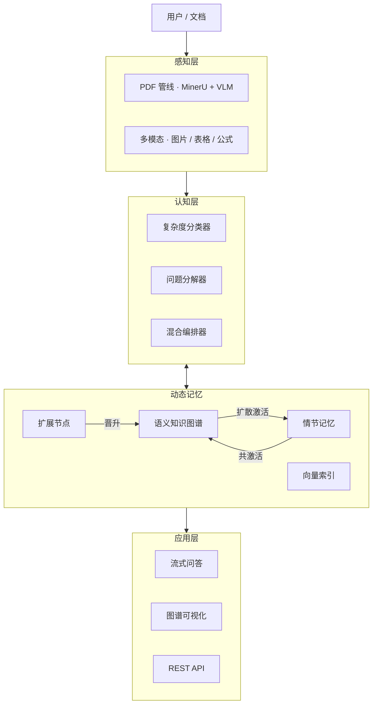
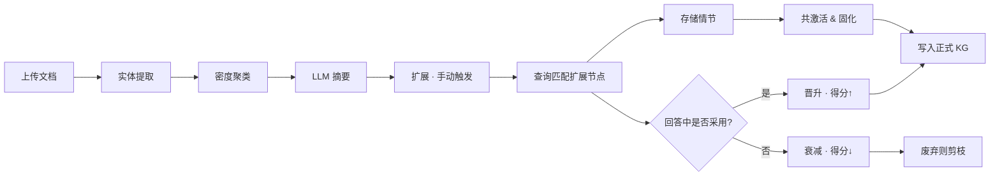

<div align="center">


# DocThinker

**从文档中构建活的、自进化的知识图谱。**

> *记忆应该是动态的，而不是静态的。*

[](LICENSE)
[](https://www.python.org/downloads/)
[](https://fastapi.tiangolo.com/)
[]()

[中文](README.zh-CN.md) | [English](README.md)

</div>

<!-- TODO: 替换为实际截图 -->
<div align="center">

<p><sub>知识图谱可视化：密度聚类扩展、情节记忆链接、多模态实体节点。</sub></p>
</div>

---

## ✨ 特性一览

<table>
<tr>
<td align="center" width="25%"><br/><b>🧠 动态知识图谱</b><br/>图谱通过使用反馈自动生长、重构和剪枝。<br/><br/></td>
<td align="center" width="25%"><br/><b>💡 自进化机制</b><br/>LLM 扩展节点经查询验证——有用则晋升，无用则淘汰。<br/><br/></td>
<td align="center" width="25%"><br/><b>🔗 情节记忆</b><br/>每轮问答成为可检索情节，通过扩散激活唤醒关联记忆。<br/><br/></td>
<td align="center" width="25%"><br/><b>📄 多模态 PDF</b><br/>MinerU + VLM 双管线，提取文本/表格/公式/图片为 KG 实体。<br/><br/></td>
</tr>
<tr>
<td align="center"><br/><b>🔬 密度聚类</b><br/>HDBSCAN 聚类实体 embedding，为每个聚类生成 LLM 摘要。<br/><br/></td>
<td align="center"><br/><b>🤖 自动思考</b><br/>自动分类查询复杂度，路由到快速/混合/多步分解后端。<br/><br/></td>
<td align="center"><br/><b>📊 图谱可视化</b><br/>D3.js 力导向图，支持节点描述、边标签、扩展/过滤。<br/><br/></td>
<td align="center"><br/><b>⚡ 三种查询模式</b><br/>快速（向量）、标准（混合）、深度（扩散激活+情节+扩展匹配）。<br/><br/></td>
</tr>
</table>

## 🚀 快速开始

```bash
git clone https://github.com/Yang-Jiashu/doc-thinker.git && cd doc-thinker
conda create -n docthinker python=3.11 -y && conda activate docthinker
pip install -r requirements.txt && pip install -e .
cp env.example .env  # ← 填入 API Key（OpenAI / DashScope / SiliconFlow）
```

**启动：**

```bash
# 终端 1 — 后端
python -m uvicorn docthinker.server.app:app --host 0.0.0.0 --port 8000

# 终端 2 — 前端
python run_ui.py
```

打开 `http://localhost:5000`，上传 PDF，提问，在 KG 页面点击 **扩展**。

## 🏗 架构



## 🔄 自进化循环



扩展节点从**候选**状态开始，只有经真实查询验证通过的才能存活——知识图谱自己赢得自己的知识。

## 🔍 查询模式

| 模式 | 策略 | 速度 | 深度 |
|------|------|------|------|
| ⚡ **快速** | 向量相似度 | ~1s | 浅 |
| ⚖️ **标准** | 混合 KG + 向量 | ~3s | 中 |
| 🧠 **深度** | 扩散激活 + 情节记忆 + 扩展匹配 + 反馈 | ~8s | 完整 |

<details>
<summary><b>深度模式管线（6 步）</b></summary>

1. 从情节记忆中检索类比情节。
2. 将扩展候选节点与查询进行匹配。
3. 将命中的扩展节点作为强制检索指令注入。
4. 混合 KG + 向量检索并启用扩散激活。
5. LLM 使用完整上下文生成回答。
6. 查询后反馈：验证扩展节点、存储情节、共激活链接强化。

</details>

## 📄 PDF 处理

| 模式 | 引擎 | 适用场景 |
|------|------|---------|
| `auto`（默认） | VLM（短文档）/ MinerU（长文档） | 通用 |
| `vlm` | 云端 VLM（Qwen-VL） | 图片密集文档 |
| `mineru` | MinerU 布局引擎 | 含表格的长文档 |

在 `config/settings.yaml` 中配置，或通过环境变量 `PDF_PARSE_MODE` 覆盖。

## 🌐 知识图谱扩展

| 阶段 | 触发方式 | 过程 |
|------|---------|------|
| **聚类** | 自动（上传后） | HDBSCAN 聚类实体 → LLM 生成聚类摘要 |
| **扩展** | 手动（"扩展"按钮） | A: 基于聚类摘要生成 · B: Top-50 节点多角度生成 |
| **生命周期** | 自动（每次查询） | `候选 → 活跃 → 晋升`（进入正式 KG）或 `废弃`（剪枝） |

每个扩展节点均包含：具体描述 + 类型化边 + 向量嵌入 + `is_expanded` 标识。

<details>
<summary><b>📡 API 参考</b></summary>

| 类别 | 端点 | 方法 | 说明 |
|------|------|------|------|
| 会话 | `/sessions` | GET/POST | 列出 / 创建会话 |
| | `/sessions/{id}/history` | GET | 聊天历史 |
| | `/sessions/{id}/files` | GET | 已上传文件 |
| 上传 | `/ingest` | POST | 上传 PDF/TXT |
| | `/ingest/stream` | POST | 流式文本上传 |
| 查询 | `/query/stream` | POST | SSE 流式查询 |
| | `/query` | POST | 非流式查询 |
| KG | `/knowledge-graph/data` | GET | 可视化节点/边 |
| | `/knowledge-graph/expand` | POST | 触发扩展 |
| | `/knowledge-graph/stats` | GET | KG 统计 |
| 记忆 | `/memory/stats` | GET | 情节计数 |
| | `/memory/consolidate` | POST | 触发记忆固化 |
| 设置 | `/settings` | GET/POST | 运行时配置 |

</details>

<details>
<summary><b>📂 项目结构</b></summary>

| 目录 | 说明 |
|------|------|
| `docthinker/` | 核心：解析、KG、查询、扩展（`kg_expansion/`）、自动思考（`auto_thinking/`）、HyperGraphRAG（`hypergraph/`）、服务端（`server/`）、UI（`ui/`）。 |
| `graphcore/` | 图 RAG 引擎：KG 存储（NetworkX/FAISS/Qdrant/PG）、向量检索、实体提取、重排序。 |
| `neuro_memory/` | 情节记忆：扩散激活、情节存储、类比检索、记忆固化。 |
| `config/` | `settings.yaml` — PDF、记忆、检索、认知参数。 |

</details>

## 🤝 贡献

欢迎 PR 和 Issue！详见 [CONTRIBUTING.md](CONTRIBUTING.md)。

## 📄 协议

[MIT](LICENSE)
